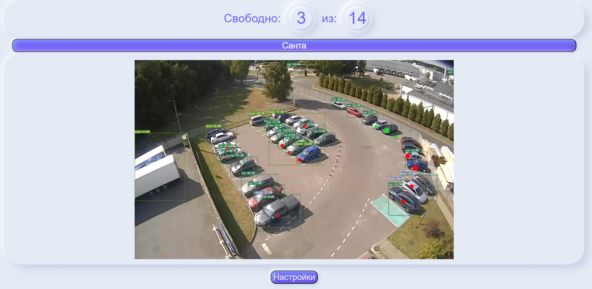
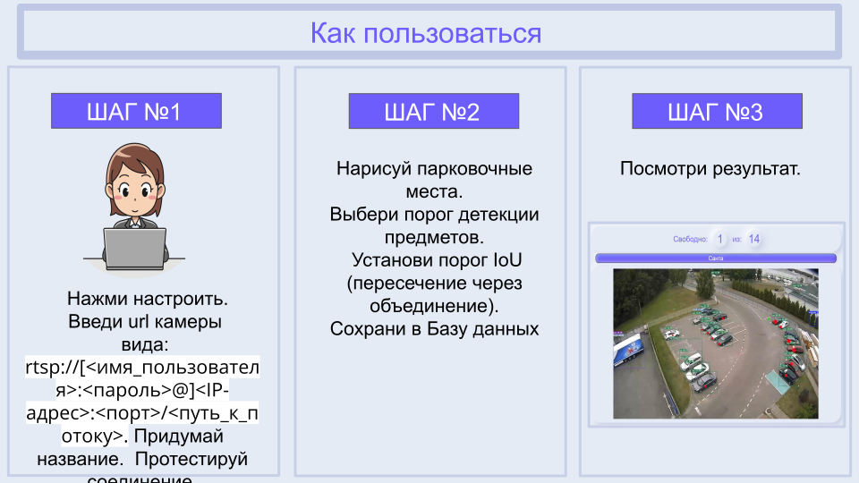
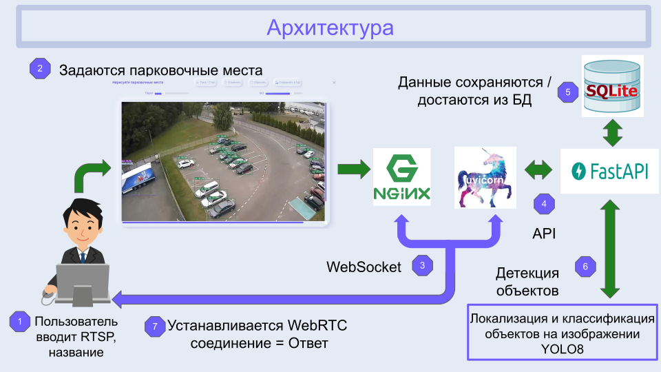

<h1 align="center">✨ Free Parking Space ✨</h1>

  

## ***Навигация***
- [Описание](#описание)
- [Возможные неполадки](#возможные_неполадки)
- [Как пользоваться сервисом](#как_пользоваться)
  - [Архитектура](#архитектура)
  - [Технологии](#Технологии)
- [How to install](#how_to_install)

 
## ***Описание***

Сервис реализован для распознавания свободных мест на парковке автомобилей.
Пользователь сможет заранее проверить парковку на наличие и количество свободных мест.
Пользователь может сам задавать RTSP путь к видеокамере и рисовать произвольные парковочные места.

 
## ***Возможные неполадки***

При использовании сервиса возможно некорректное отображение парковочного места.

**Решение проблемы:**

Правильно размещать видеокамеру

 
## ***Как пользоваться сервисом***
-  Если камера уже добавлена
    - После нажатия на нужную кнопку - пользователь установит соединение с WEB камерой, и отобразится информация о заполненности парковки. Предположительные свободные места будут отмечены **зеленым кругом**. 
    

    

 
-  Если необходимо добавить камеру
    

    

 
### Архитектура

 

 
### Технологии

- [OpenCV](https://opencv.org/)
- [AioRtc](https://github.com/aiortc/aiortc)
- [VUE](https://vuejs.org/)
- [YOLO](https://docs.ultralytics.com/)

 
## ***How to install***

- Метод №1 (Подходит для разворачивания на Linux системах (На Windows и Mac работать не будет)):
  - Клонировать репозиторий
  - Выполнить команду docker-compose build
  - Выполнить команду docker-compose up
  - Пререйти по адресу 127.0.0.1:8080

- Метод №2 (Подходит для любых систем (local)):
  - Клонировать репозиторий
  - Настройка BACKEND
    - Установить python https://www.python.org/
    - Перейти в папку cd backend
    - Установить зависимости pip install -r requirements.txt
    - Запустить файл main.py
    - Должен запуститься webserver на 127.0.0.1:8000
  - Настройка FRONTEND
    - Установить nodejs https://nodejs.org/en
    - Перейти в папку cd frontend
    - Запустить команду npm install
    - Запустить команду npm run dev
    - Должен запуститься webserver на 127.0.0.1:8000